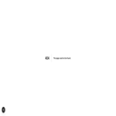

# 测试报告 - 登录功能

## 测试概述

| 项目 | 内容 |
|------|------|
| 测试时间 | 2026-01-15 18:04:27 |
| 测试人员 | AI Automation (test-workflow) |
| 测试环境 | Chrome / http://localhost:3000 |
| 测试类型 | 功能测试 |

---

## 测试过程



---

## 测试用例详情

### 用例 1: 打开登录页面

**状态**: ✅ 通过

**截图**:


---

### 用例 2: 输入用户名

**状态**: ❌ 失败

**错误**: `Page.fill: Timeout 30000ms exceeded.
Call log:
  - waiting for locator("input[name='username']")
`

---

### 用例 3: 输入密码

**状态**: ❌ 失败

**错误**: `Page.fill: Timeout 30000ms exceeded.
Call log:
  - waiting for locator("input[name='password']")
`

---

### 用例 4: 点击登录按钮

**状态**: ❌ 失败

**错误**: `Page.click: Timeout 30000ms exceeded.
Call log:
  - waiting for locator("button[type='submit']")
`

---

### 用例 5: 验证登录成功

**状态**: ❌ 失败

**错误**: `Page.wait_for_selector: Timeout 5000ms exceeded.
Call log:
  - waiting for locator(".user-dashboard") to be visible
`

---

## 测试结果汇总

| # | 用例名称 | 状态 | 详情 |
|---|----------|------|------|
| 1 | 打开登录页面 | ✅ 通过 | [查看](screenshots/01_login_page.png) |
| 2 | 输入用户名 | ❌ 失败 | `Page.fill: Timeout 30000ms exceeded.
Call log:
  - waiting for locator("input[name='username']")
` |
| 3 | 输入密码 | ❌ 失败 | `Page.fill: Timeout 30000ms exceeded.
Call log:
  - waiting for locator("input[name='password']")
` |
| 4 | 点击登录按钮 | ❌ 失败 | `Page.click: Timeout 30000ms exceeded.
Call log:
  - waiting for locator("button[type='submit']")
` |
| 5 | 验证登录成功 | ❌ 失败 | `Page.wait_for_selector: Timeout 5000ms exceeded.
Call log:
  - waiting for locator(".user-dashboard") to be visible
` |
---

## 测试结论

| 指标 | 结果 |
|------|------|
| 总用例数 | 5 |
| 通过数 | 1 |
| 失败数 | 4 |
| **通过率** | **20%** |

### 结论

⚠️ **部分测试失败，请检查**

---

## 附录

### 测试环境

- **浏览器**: Chromium (Playwright)
- **GIF 规格**: 128x128 @ 10fps (Slack 优化)
- **截图格式**: PNG

### 输出文件

```
test_output/
├── test_process.gif      # 测试过程动画
├── test_report.md        # 本报告
└── screenshots/          # 验证点截图
```

---

*本报告由 test-workflow 技能自动生成*
